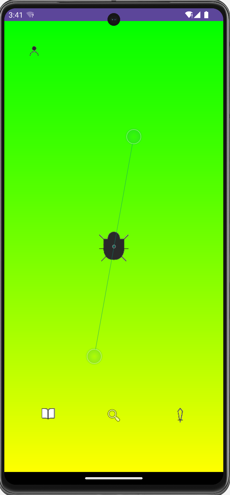
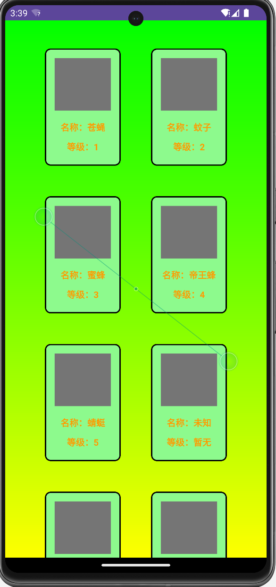
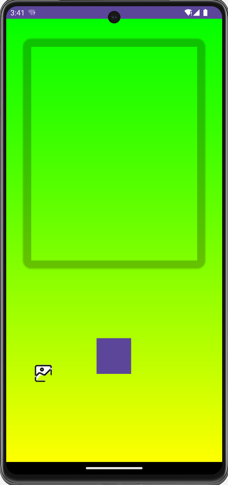
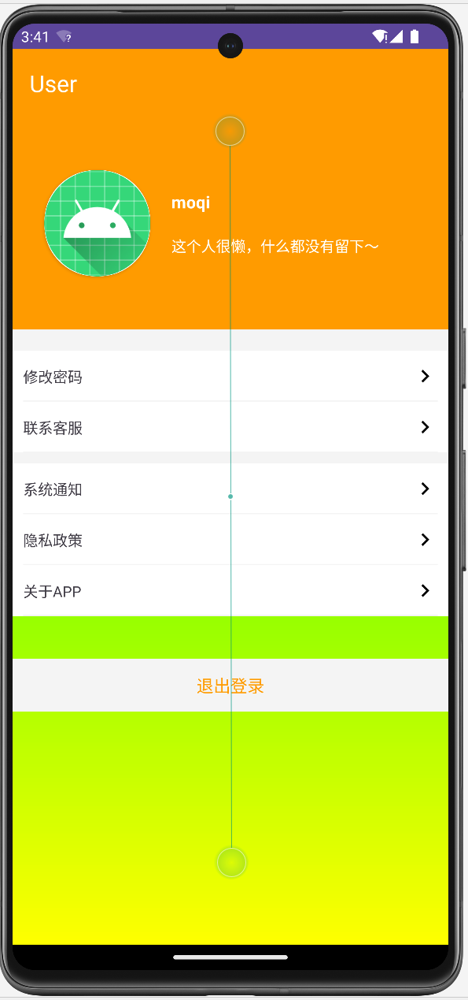

# Interaction-design

---
## ui界面
**主界面设计：**  
  

**图鉴设计：**  
  

**拍照设计：**  
  

**用户界面：**  


---
## 安卓开发技术文档
### drawable  
shape：
- rectangle模版（圆角矩形）
- background（背景颜色）
- 所要的组件图片的导入

### layout
布局文件用到的模版样式：
- androidx.constraintlayout.widget.ConstraintLayout
- RelativeLayout
- LinearLayout
- CardView
- Toolbar
- LinearLayoutCompat
- ScrollView
- GridLayout

### 按钮功能实现：
e.p:
```Java
ImageButton userButton = findViewById(R.id.userButton);
        userButton.setOnClickListener(new View.OnClickListener() {
            @Override
            public void onClick(View view) {
                Intent userIntent = new Intent(MainActivity.this, UserActivity.class);
                startActivity(userIntent);
            }
        });
```

### 拍照功能调用：
在AndroidManifest.xml文件中配置如下权限：  
```xml
<uses-feature android:name="android.hardware.camera" />
<uses-feature android:name="android.hardware.camera.autofocus" />
<uses-permission android:name="android.permission.CAMERA" />
<uses-permission android:name="android.permission.WRITE_EXTERNAL_STORAGE" />
```

Java代码中拍照功能以及读取相册功能实现：  
```Java
 // 打开相册
    private void openGallery() {
        Intent galleryIntent = new Intent(Intent.ACTION_PICK, MediaStore.Images.Media.EXTERNAL_CONTENT_URI);
        startActivityForResult(galleryIntent, GALLERY_REQUEST_CODE);
    }

    // 检查相机权限
    private boolean checkCameraPermission() {
        return ContextCompat.checkSelfPermission(this, android.Manifest.permission.CAMERA) == PackageManager.PERMISSION_GRANTED;
    }

    // 请求相机权限
    private void requestCameraPermission() {
        ActivityCompat.requestPermissions(this, new String[]{android.Manifest.permission.CAMERA}, CAMERA_PERMISSION_REQUEST_CODE);
    }

    // 打开相机
    private void openCamera() {
        Intent cameraIntent = new Intent(MediaStore.ACTION_IMAGE_CAPTURE);
        startActivityForResult(cameraIntent, CAMERA_REQUEST_CODE);
    }

    // 处理权限请求的结果
    @Override
    public void onRequestPermissionsResult(int requestCode, @NonNull String[] permissions, @NonNull int[] grantResults) {
        super.onRequestPermissionsResult(requestCode, permissions, grantResults);
        if (requestCode == CAMERA_PERMISSION_REQUEST_CODE) {
            if (grantResults.length > 0 && grantResults[0] == PackageManager.PERMISSION_GRANTED) {
                openCamera();
            } else {
                Toast.makeText(this, "Camera permission denied", Toast.LENGTH_SHORT).show();
            }
        }
    }
```

### 识别功能实现
Chaquopy 是一个用于在 Android Studio 中嵌入 Python 代码的插件。我们通过ChaquoPy方法调用我们的python方法。  
在gradle中配置：  
```gradle
plugins {
    id 'com.chaquo.python'
}

chaquopy {
    pythonVersion "3.8"  // 选择所需的 Python 版本
    ndkVersion "21.4.7075529"  // 选择所需的 NDK 版本
}
```
在文件中调用方法：  
```Java
 protected void onCreate(Bundle savedInstanceState) {
        super.onCreate(savedInstanceState);
        setContentView(R.layout.activity_main);

        Python python = Python.getInstance();
        PyObject pyObject = python.getModule(imagePath);
        String result = pyObject.callAttr(imagePath).toString();

        Toast.makeText(this, result, Toast.LENGTH_SHORT).show();
    }
```

获取图片路径：  
```Java
// 将Bitmap保存到文件中
    private String saveBitmapToFile(Bitmap imageBitmap, String title) {
        // 声明变量
        String imageFilePath = "";

        // 保存文件到应用私有目录
        File imageFile = new File(getFilesDir(), title + ".jpg");

        try (FileOutputStream fos = new FileOutputStream(imageFile)) {
            imageBitmap.compress(Bitmap.CompressFormat.JPEG, 100, fos);

            // 获取文件路径
            imageFilePath = imageFile.getAbsolutePath();

            // 将文件添加到相册
            MediaStore.Images.Media.insertImage(getContentResolver(), imageFilePath, title, null);

            // 刷新相册
            sendBroadcast(new Intent(Intent.ACTION_MEDIA_SCANNER_SCAN_FILE, Uri.fromFile(imageFile)));

        } catch (IOException e) {
            e.printStackTrace();
        }

        return imageFilePath;
    }

    // 获取图片文件路径
    private String getImagePath(Uri uri) {
        String[] projection = {MediaStore.Images.Media.DATA};
        Cursor cursor = getContentResolver().query(uri, projection, null, null, null);
        if (cursor != null) {
            int columnIndex = cursor.getColumnIndexOrThrow(MediaStore.Images.Media.DATA);
            cursor.moveToFirst();
            String filePath = cursor.getString(columnIndex);
            cursor.close();
            return filePath;
        }
        return null;
    }
```

### 图鉴功能
先建立一个库用来保存可以识别的昆虫。  
```Java
// 获取之前保存的动物名称
String savedAnimalName = AnimalNameManager.getAnimalName(this);

// 设置CardView的属性
setCardViewAttributes(R.id.cardView1, R.drawable.cangying, "苍蝇", "1", savedAnimalName);
setCardViewAttributes(R.id.cardView2, R.drawable.wenzi, "蚊子", "2", savedAnimalName);
setCardViewAttributes(R.id.cardView3, R.drawable.mifeng, "蜜蜂", "3", savedAnimalName);
setCardViewAttributes(R.id.cardView4, R.drawable.huangfeng, "帝王蜂", "4", savedAnimalName);
setCardViewAttributes(R.id.cardView5, R.drawable.qingting, "蜻蜓", "5", savedAnimalName);

// 更新CardView的显示
updateCardViews();
```

新建一个工具类来储存识别到的昆虫：  
```Java
public class AnimalNameManager {
    private static final String PREF_NAME = "AnimalNamePrefs";
    private static final String KEY_ANIMAL_NAME = "animalName";

    private static SharedPreferences getSharedPreferences(Context context){
        return context.getSharedPreferences(PREF_NAME, Context.MODE_PRIVATE);
    }

    public static void saveAnimalName(Context context, String animalName){
        SharedPreferences.Editor editor = getSharedPreferences(context).edit();
        editor.putString(KEY_ANIMAL_NAME, animalName);
        editor.apply();
    }

    public static String getAnimalName(Context context){
        return getSharedPreferences(context).getString(KEY_ANIMAL_NAME,null);
    }
}

```
识别出来后遍历更新即可。  

---
## Unity嵌入
点开ProjectStructure，导入新模块unityLibrary，并为app模块提供依赖。  
在gradle.properties文件中添加：
`unityStreamingAssets=.unity3d, google-services-desktop.json, google-services.json, GoogleService-Info.plist`

根据出现的报错信息进行修改，之后写一个链接的按钮事件：  
```Java
findViewById(R.id.gameButton).setOnClickListener(v -> {
            Intent intent = new Intent(MainActivity.this, UnityPlayerActivity.class);
            startActivity(intent);
        });
```
